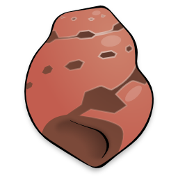

# S. Cargo

This is S. Cargo, the epic snail adventure game! This game is written in Python, and runs in the Blender Game Engine.

<p align="center">

</p>

## Building for Distribution

1. [Download Blender][bdl]\*. Grab one archive for each platform you want to build for, and one for the platform you're building on. Save them to the [blender](blender) directory.
1. Extract the Blender archive for the platform you are currently using - e.g. `cd blender; tar xvf blender-2.69-fdcdd5e-linux-glibc211-x86_64.tar.bz2`.
1. Run `make` using the version of Blender you're building with:

```bash
make BLENDER=`pwd`/blender/blender-2.69-fdcdd5e-linux-glibc211-x86_64/blender
```

This will result in one game archive in the `dist` directory for each Blender archive you downloaded. Your users can untar or unzip the relevant archive, and then run the `cargo` executable that is inside to play the game.

\* At the time of writing, this game was tested to work with version 2.69 fdcdd5e (2014-02-13). Other versions may work too. If you want the bleeding edge, you can grab a copy from the [Blender Buildbot][bbb], or [compile your own][bsc] from Blender's source code.

## Building for Development and Testing

You can play Cargo without building a distributable. The steps are similar to those given above.

1. [Download Blender][bdl] for your current platform.
1. Extract the Blender archive.
1. Run `make foliage`:

```bash
make BLENDER=`pwd`/blender/blender-2.69-fdcdd5e-linux-glibc211-x86_64/blender foliage
```

This will generate .blend files required to display the grass and flowers in the game. Then you can play the game by loading `game/cargo.blend` in Blender and choosing *Game > Start Game Engine* from the menu at the top. Most of the files in `game/assets` can be loaded that way, too - although the saved game data is not shared between files.

[bdl]: http://download.blender.org/release
[bbb]: http://builder.blender.org/download/
[bsc]: http://wiki.blender.org/index.php/Dev:Contents
